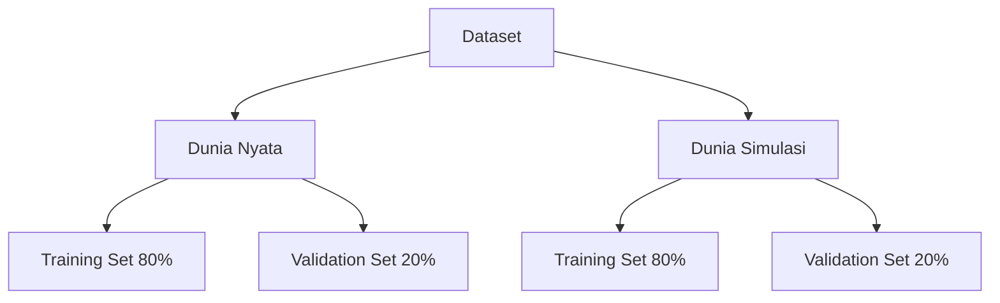

# datasheetYoloV5
2000 datasets

```mermaid
graph TD;
    A[Dataset] --> B[Dunia Nyata];
    A --> C[Dunia Simulasi];
    B --> D[Training Set 80%];
    B --> E[Validation Set 20%];
    C --> F[Training Set 80%];
    C --> G[Validation Set 20%];

```
# datasheetYoloV5

